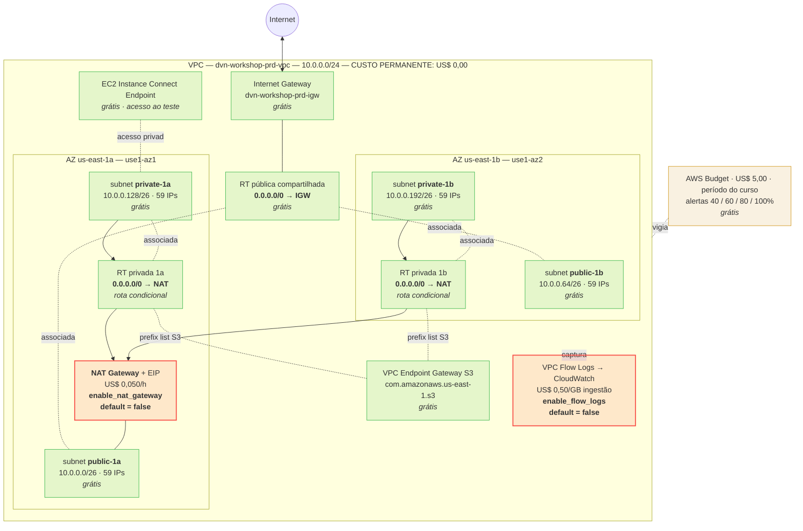

# ADR-0001 — Arquitetura de rede na AWS (VPC, subnets, roteamento e egress)

| Campo            | Valor                                                                  |
| ---------------- | ---------------------------------------------------------------------- |
| **Status**       | Aprovado                                                               |
| **Data**         | 2026-08-12                                                             |
| **Aprovado em**  | 2026-08-12                                                             |
| **Autor**        | Agente Arquiteto Cloud e DevOps                                        |
| **Decisor**      | Laura                                                                  |
| **Relacionados** | **Emendado por ADR-0002** (SGs de acesso e supressões checkov). Bloqueia o futuro ADR de compute. |
| **Tags**         | aws, terraform, vpc, networking, nat-gateway, egress, workshop, finops |

---

## 1. Contexto

Laboratório prático de um **curso de DevOps com IA**. Sem SLA, sem cliente, sem tráfego real, sem dado sensível.

| Caminho                                   | Estado                                                                     |
| ----------------------------------------- | -------------------------------------------------------------------------- |
| `project-terraform/`                      | Vazio. Greenfield — é onde o Terraform vai morar.                          |
| `docs/adr/`                               | Guarda os ADRs.                                                            |
| `example-apps/backend/YoutubeLiveApp/`    | .NET + `Dockerfile`                                                        |
| `example-apps/frontend/youtube-live-app/` | Node + `Dockerfile`                                                        |
| `example-apps/ecr-apps.json`              | ECR: `dvn-workshop/production/backend`, `dvn-workshop/production/frontend` |

Não há infraestrutura provisionada nem ADR anterior. Qualquer decisão de compute (ECS / EKS / Lambda / EC2 — **ainda não decidida**) depende de uma camada de rede. Este ADR define essa camada e **nada além dela**.

---

## 2. Requisitos e restrições

**Funcionais:** VPC própria em `us-east-1`, conta única, ambiente único `prd` · subnets **públicas** capazes de hospedar recursos com IP público · subnets **privadas** sem IP público, com **egress** para a internet (pull do ECR, `apt`/`nuget`/`npm`, APIs da AWS) · rede **agnóstica ao compute** · **2 AZs** · **objetivo pedagógico inegociável:** ensinar a mecânica `IGW → subnet pública → NAT → route table privada`.

**Não funcionais:** SLA nenhum · RTO/RPO não aplicável (sem dado persistente; a rede é 100% recriável por `apply`) · escala desprezível · **custo de US$ 5,00 no total para o curso inteiro, limite rígido** · observabilidade suficiente para depurar conectividade, sem custo permanente.

**Restrições:**

| #   | Restrição                                                                                                |
| --- | -------------------------------------------------------------------------------------------------------- |
| C1  | **Teto de US$ 5,00 para o laboratório inteiro.** Não é meta, é limite. Toda decisão é subordinada a ele. |
| C2  | O teto cobre **todo o curso**, não só a rede. O ADR de compute consome do mesmo bolso.                   |
| C3  | **Terraform `~> 1.13`** (1.15.8 instalado). `tflint` 0.64.0 e `checkov` 3.3.10 disponíveis.              |
| C4  | Profile AWS `app_cloud_devops`, região `us-east-1`, conta única, **usuário IAM** (não role).             |
| C5  | Nenhum requisito de compliance (PCI, HIPAA, LGPD com dado real).                                         |
| C6  | Conta no **plano Free baseado em créditos**, com expiração em **2026-12-03**. Ver P8, R12 e §11.6.       |

**Entradas fixadas pela usuária — não são questão em aberto:** VPC `10.0.0.0/24`; subnets públicas `10.0.0.0/26` (`us-east-1a`) e `10.0.0.64/26` (`us-east-1b`); subnets privadas `10.0.0.128/26` (`us-east-1a`) e `10.0.0.192/26` (`us-east-1b`); **um único NAT Gateway** compartilhado pelas duas AZs. Os quatro `/26` são contíguos, não se sobrepõem e preenchem o `/24` exatamente (4 × 64 = 256); cada um oferece **59 IPs utilizáveis** (64 − 5 reservados pela AWS).

---

## 3. Premissas

| #   | Premissa                                                                                                                                | Bloqueante? | Como validar                                                                                          |
| --- | --------------------------------------------------------------------------------------------------------------------------------------- | ----------- | ----------------------------------------------------------------------------------------------------- |
| P1  | O egress tarifado é desligado ao final de cada sessão (`enable_nat_gateway = false`). Todo o orçamento depende disso.                   | **Sim**     | `aws ec2 describe-nat-gateways --filter Name=state,Values=available` diariamente. Ver §11.5.          |
| P2  | O tráfego pelo NAT é de poucos GB no curso inteiro; as camadas de imagem do ECR passam pelo S3 Gateway Endpoint, fora do NAT.           | Não         | Métrica `BytesOutToDestination`. Cada GB = US$ 0,045.                                                 |
| P3  | Não haverá conectividade híbrida (VPN, Direct Connect, peering, Transit Gateway).                                                       | Não         | Confirmação da usuária. Se mudar, o `/24` vira problema de alocação e exige ADR sucessor.             |
| P4  | O compute futuro **não será EKS com VPC CNI em modo padrão**.                                                                           | Não         | Entrada obrigatória do ADR de compute. Ver R3.                                                        |
| P5  | O bucket de state do Terraform ainda não existe; será criado no passo 2.                                                                | Não         | `aws s3api head-bucket` antes do `terraform init`.                                                    |
| P6  | O usuário IAM `app_cloud_devops` pode criar VPC, NAT, EIP, endpoints, roles IAM, log groups **e budgets**.                              | **Sim**     | Validar antes dos passos 1 e 8. Um `plan` não pega falta de `iam:CreateRole`; o `apply` falha.        |
| P7  | Não há Service Quota bloqueando (padrão: 5 VPCs/região, 5 EIPs/região).                                                                 | Não         | `aws service-quotas get-service-quota --service-code ec2 --quota-code L-0263D0A3`.                    |
| P8  | **O teto de US$ 5,00 mede consumo bruto, não desembolso** — a conta tem US$ 140,00 de créditos, então o desembolso hoje seria US$ 0,00. | **Sim**     | **Perguntar ao professor.** Se o teto for sobre desembolso, já está satisfeito por construção.        |
| P9  | O teto de US$ 5,00 cobre **todo o laboratório**, incluindo o compute ainda não decidido.                                                | **Sim**     | **Perguntar ao professor.** Define quanto deste ADR pode consumir. A reserva de §11.4 assume que sim. |

---

## 4. Opções consideradas

O CIDR e a quantidade de NAT estão fixados. Decide-se aqui **como o egress das subnets privadas é servido e quando ele existe** — onde mora 100% do custo desta camada. Todas as opções são cotadas em US$ por hora de existência.

**Opção A — NAT Gateway zonal único, efêmero (recomendada).** IGW, uma RT pública compartilhada, um NAT Gateway (`availability_mode = "zonal"`) em `public-1a`, duas RTs privadas com `0.0.0.0/0 → NAT`. EIP, NAT e rotas condicionados a `var.enable_nat_gateway`, default `false`.

- **Prós:** padrão canônico de VPC, máximo valor pedagógico; custo permanente US$ 0,00; recriável em ~3 min, sem estado.
- **Contras:** a mais cara por hora ligada; SPOF de AZ; depende de disciplina humana para desligar.
- **Custo:** **US$ 0,050/h ligado** (NAT US$ 0,045 + IPv4 US$ 0,005) + US$ 0,045/GB. **US$ 0,00/h desligado.** · **Complexidade:** baixa, ~10 recursos, sem código imperativo.

**Opção B — Sem NAT, workloads em subnet pública.** Saída pelo IGW com IP público; subnets privadas ficam sem rota default.

- **Prós:** US$ 0,00/h de egress; menos recursos.
- **Contras:** viola o requisito funcional — sem NAT, "privada" vira decoração; cada workload precisa de IPv4 público a US$ 0,005/h; expõe workload direto à internet.
- **Custo:** US$ 0,00/h de rede + US$ 0,005/h por IP público de workload. · **Complexidade:** muito baixa.

**Opção C — NAT Gateway regional (`availability_mode = "regional"`).** Um NAT que se expande pelas AZs onde a VPC tem subnets, com um EIP por AZ.

- **Prós:** sem SPOF de AZ; mesma tarifa horária de NAT.
- **Contras:** um EIP por AZ; a RT gerenciada pela AWS esconde a mecânica IGW ↔ subnet pública ↔ NAT ↔ RT privada; recurso de 11/2025, com pouco material de apoio.
- **Custo:** **US$ 0,055/h** (0,045 + 2 × 0,005). · **Complexidade:** baixa, com menos precedente público para depurar.

**Opção D — NAT instance em `t4g.nano`.** EC2 em `10.0.0.0/26` com `source_dest_check = false`, `net.ipv4.ip_forward = 1` e `iptables -t nat -A POSTROUTING -j MASQUERADE` via `user_data`; RTs privadas apontam `0.0.0.0/0` para a ENI.

- **Prós:** ~5× mais barata por hora; **sem tarifa por GB processado**; ensina SNAT por dentro.
- **Contras:** troca o objeto do exercício (rede → administração de Linux); SPOF de instância; falha em runtime, não no `apply`; a AMI oficial de NAT está descontinuada e `fck-nat` vem do Marketplace, ao qual contas no plano Free podem não ter acesso — sobra Amazon Linux 2023 + `user_data` à mão.
- **Custo:** **US$ 0,0101/h** = t4g.nano US$ 0,0042 + IPv4 público US$ 0,0050 + EBS gp3 8 GB US$ 0,00088. · **Complexidade:** média, única com código imperativo e pin de AMI.

| Critério                         | A — NAT GW efêmero     | B — Sem NAT | C — NAT regional | D — NAT instance      |
| -------------------------------- | ---------------------- | ----------- | ---------------- | --------------------- |
| **Custo/h ligado**               | US$ 0,050              | US$ 0,000   | US$ 0,055        | **US$ 0,0101**        |
| **Custo/h desligado**            | **US$ 0,000**          | US$ 0,000   | US$ 0,000        | US$ 0,000             |
| Custo por GB de egress           | US$ 0,045              | US$ 0,000   | US$ 0,045        | **US$ 0,000**         |
| Respeita a entrada da usuária    | **Sim, literalmente**  | Não         | Sim (NAT único)  | Não (troca o recurso) |
| Ensina o padrão canônico de VPC  | **Sim, integralmente** | Não         | Parcialmente     | Parcialmente          |
| Subnet privada é de fato privada | **Sim**                | Não         | Sim              | Sim                   |
| Risco de falha em runtime        | **Nenhum**             | Nenhum      | Nenhum           | Médio (`user_data`)   |
| Maturidade / material de apoio   | **Máxima**             | Máxima      | Baixa (11/2025)  | Média                 |
| Nº de recursos Terraform         | ~10                    | ~6          | ~8               | ~13                   |

---

## 5. Decisão

**Escolhida: Opção A — NAT Gateway zonal único em `us-east-1a`, com `enable_nat_gateway = false` como default e o ciclo `apply → exercício → destroy` como fluxo operacional principal.**

A Opção A cabe no orçamento (§11.4) e é a única que entrega integralmente o objetivo pedagógico. A economia da Opção D — de US$ 1,20 a US$ 3,11 ao longo do curso — não paga a troca do objeto de estudo.

**Contingência com gatilho numérico:** se o gasto acumulado passar de **US$ 2,50** e ainda restar mais de metade do curso, migrar para a Opção D — altera apenas o alvo da rota `0.0.0.0/0` nas duas RTs privadas, que já existem por AZ.

**Sugestão futura, não recomendação:** se o projeto sair do laboratório, a Opção C passa a valer — é troca de argumento no `aws_nat_gateway` mais ajuste de rotas.

As decisões complementares (AZs, route tables, endpoints, SGs, NACLs, acesso de teste, Budget) estão especificadas nas seções 6, 9 e 11.

### Well-Architected

| Pilar                     | Avaliação                                                                                                                                                                                                                                    |
| ------------------------- | -------------------------------------------------------------------------------------------------------------------------------------------------------------------------------------------------------------------------------------------- |
| Excelência Operacional    | **Bom.** 100% IaC, tags rastreando até o ADR, `tflint` + `checkov` no fluxo, rollback de um comando. O ciclo efêmero transfere responsabilidade ao humano — mitigado por budget e verificação diária.                                        |
| Segurança                 | **Adequado ao contexto.** Sem IP público em subnet privada, default SG travado, IAM least privilege com proteção contra confused deputy, acesso via EIC Endpoint. **Sacrificados:** NACLs customizadas, CMK do KMS, Flow Logs sempre ativos. |
| Confiabilidade            | **Deliberadamente sacrificado.** NAT único = SPOF de AZ, e por padrão nem existe. Não há SLA. Ver R1.                                                                                                                                        |
| Eficiência de Performance | **Não é dimensão relevante.** O NAT Gateway escala muito além do tráfego de um lab.                                                                                                                                                          |
| Otimização de Custos      | **Prioridade absoluta, imposta estruturalmente.** O estado default custa US$ 0,00; todo custo exige ato deliberado (`-var enable_nat_gateway=true`).                                                                                         |
| Sustentabilidade          | **Bom por consequência.** O recurso mais caro não existe por padrão.                                                                                                                                                                         |

### Trade-offs aceitos

| Abrimos mão de…                        | Por quê                                                                         | Risco residual                                        |
| -------------------------------------- | ------------------------------------------------------------------------------- | ----------------------------------------------------- |
| Egress privado disponível o tempo todo | US$ 0,050/h × 730 h estouraria o teto do curso em ~4 dias.                      | R10                                                   |
| Flow Logs sempre ligados               | US$ 0,50/GB de ingestão. 1 GB = 10% do teto do curso.                           | R9                                                    |
| 5× de economia da Opção D              | O objetivo é ensinar NAT gerenciado, não administrar `iptables`.                | Nenhum, sob o gatilho de US$ 2,50.                    |
| Alta disponibilidade do egress         | Um segundo NAT dobraria o custo horário.                                        | R1                                                    |
| Espaço de crescimento da VPC           | O `/24` está 100% alocado por decisão da usuária.                               | R2                                                    |
| NACLs customizadas                     | Stateless, e causa clássica nº 1 de "por que meu container não conecta" em lab. | R4                                                    |
| CMK do KMS no log group                | Custo e key policy para proteger metadados de tráfego sintético.                | Baixo — criptografia gerenciada pela AWS segue ativa. |
| Interface Endpoints para ECR           | Quatro deles custariam US$ 0,04/h — quase um NAT Gateway.                       | Baixo — NAT + S3 Gateway atendem o pull.              |

---

## 6. Arquitetura proposta



> Verde = permanente e US$ 0,00. Vermelho = existe só durante o exercício e consome o orçamento. Amarelo = governança de custo.

| Componente                      | Qtd    | Configuração                                                                                                                               | Custo         |
| ------------------------------- | ------ | ------------------------------------------------------------------------------------------------------------------------------------------ | ------------- |
| VPC                             | 1      | `10.0.0.0/24`, `enable_dns_support = true`, `enable_dns_hostnames = true`, tenancy `default`.                                              | US$ 0,00      |
| Internet Gateway                | 1      | Anexado à VPC.                                                                                                                             | US$ 0,00      |
| Subnets públicas                | 2      | `10.0.0.0/26` em `us-east-1a`, `10.0.0.64/26` em `us-east-1b`. `map_public_ip_on_launch = true`.                                           | US$ 0,00      |
| Subnets privadas                | 2      | `10.0.0.128/26` em `us-east-1a`, `10.0.0.192/26` em `us-east-1b`. `map_public_ip_on_launch = false`.                                       | US$ 0,00      |
| Route table pública             | 1      | `0.0.0.0/0 → igw`. Uma só, associada às duas subnets públicas.                                                                             | US$ 0,00      |
| Route tables privadas           | 2      | **Uma por AZ** — RT não custa nada e ter duas mantém barata a migração para NAT por AZ ou Opção D. Rota `0.0.0.0/0 → nat` **condicional**. | US$ 0,00      |
| VPC Endpoint (Gateway)          | 1      | `com.amazonaws.us-east-1.s3`, associado às **duas** route tables privadas.                                                                 | US$ 0,00      |
| Default Security Group          | 1      | Gerenciado pelo Terraform **sem nenhuma regra** de ingress ou egress.                                                                      | US$ 0,00      |
| EC2 Instance Connect Endpoint   | 1      | Em `private-1a`.                                                                                                                           | US$ 0,00      |
| AWS Budget                      | 1      | Período customizado, US$ 5,00, 4 notificações por e-mail. Ver §11.5.                                                                       | US$ 0,00      |
| **Elastic IP**                  | 0 ou 1 | Para o NAT. `domain = "vpc"`. **Condicional.**                                                                                             | US$ 0,005 / h |
| **NAT Gateway**                 | 0 ou 1 | Zonal, `connectivity_type = "public"`, em `public-1a`. **Condicional.**                                                                    | US$ 0,045 / h |
| **Flow Log + role + log group** | 0 ou 1 | Nível VPC, `ALL`, CloudWatch Logs, retenção 7 dias, `max_aggregation_interval = 600`. **Condicional.**                                     | US$ 0,50 / GB |

**AZs.** Mapeamento verificado nesta conta via `ec2:DescribeAvailabilityZones`: `us-east-1a`=`use1-az1`, `1b`=`use1-az2`, `1c`=`use1-az4`, `1d`=`use1-az6`, `1e`=`use1-az3`, `1f`=`use1-az5`. Escolhidas `1a` e `1b` pela maior cobertura de tipos de instância e serviços; `us-east-1e` é historicamente a mais restrita. O mapeamento nome → ID é por conta, então as AZs vão pinadas por nome em variável, sem `data.aws_availability_zones`.

**VPC Endpoints.** Apenas **S3 e DynamoDB** têm endpoints do tipo _Gateway_; o **ECR não tem endpoint Gateway** — acesso privado a ele exigiria Interface Endpoints (`ecr.api`, `ecr.dkr`), cobrados.

| Endpoint                           | Tipo      | Custo                           | Decisão                                                                                 |
| ---------------------------------- | --------- | ------------------------------- | --------------------------------------------------------------------------------------- |
| `com.amazonaws.us-east-1.s3`       | Gateway   | **US$ 0,00**                    | **Criar.** O ECR guarda as camadas de imagem no S3, então o download pesado sai do NAT. |
| `com.amazonaws.us-east-1.dynamodb` | Gateway   | US$ 0,00                        | **Não criar.** Sem workload de DynamoDB.                                                |
| `ecr.api` / `ecr.dkr`              | Interface | US$ 0,01/h por AZ               | **Não criar.** Os dois em 2 AZs custariam US$ 0,04/h.                                   |
| Qualquer outro Interface Endpoint  | Interface | US$ 0,01/h por AZ + US$ 0,01/GB | **Não criar.**                                                                          |

**Limites de confiança.**

| Fronteira                    | Controle                                                                                     |
| ---------------------------- | -------------------------------------------------------------------------------------------- |
| Internet → subnet pública    | SG da aplicação (ADR de compute). Hoje nenhum SG permissivo existe.                          |
| Internet → subnet privada    | **Impossível por construção.** Não há rota de entrada; o NAT é unidirecional.                |
| Subnet privada → internet    | Via NAT (SNAT) **apenas quando o NAT existe**. Sem filtro de saída nesta camada.             |
| Subnet privada → S3          | Via VPC Endpoint Gateway, sem sair da rede da AWS. Funciona com o NAT desligado.             |
| Operador → instância privada | EC2 Instance Connect Endpoint, autorizado por IAM, com tentativas registradas em CloudTrail. |
| Plano de controle AWS        | IAM do usuário `app_cloud_devops` e a role de Flow Logs, escopada ao log group.              |

---

## 7. Plano de implementação

| #   | Etapa                                                                                                                           | Depende de             | Validação                                                                                 | Esforço |
| --- | ------------------------------------------------------------------------------------------------------------------------------- | ---------------------- | ----------------------------------------------------------------------------------------- | ------- |
| 1   | **Criar o AWS Budget de US$ 5,00 antes de qualquer recurso.** Período customizado, 4 notificações.                              | —                      | `aws budgets describe-budgets` retorna o budget; assinatura de e-mail confirmada.         | 20 min  |
| 2   | Criar out-of-band o bucket de state S3 (versionado, SSE-S3, Block Public Access total).                                         | —                      | `head-bucket` 200; `get-bucket-versioning` = `Enabled`.                                   | 15 min  |
| 3   | Criar o esqueleto `project-terraform/` (§8): `versions.tf`, `providers.tf`, `backend.tf` do root `envs/prd`.                    | 2                      | `terraform init` grava o state remoto; `.terraform.lock.hcl` gerado e commitado.          | 30 min  |
| 4   | Escrever `modules/network` — VPC, IGW, 4 subnets, RT pública + 2 RTs privadas, associações.                                     | 3                      | `validate` e `tflint` limpos; `plan` mostra exatamente os recursos previstos.             | 1 h 30  |
| 5   | VPC Endpoint Gateway S3 nas duas RTs privadas + EC2 Instance Connect Endpoint em `private-1a`.                                  | 4                      | `plan` mostra 1 `aws_vpc_endpoint`, 2 associações, 1 `aws_ec2_instance_connect_endpoint`. | 30 min  |
| 6   | Travar o default SG (`aws_default_security_group` com `ingress`/`egress` vazios).                                               | 4                      | `plan` mostra remoção das regras default. **Não** criar SG de aplicação.                  | 15 min  |
| 7   | EIP + NAT Gateway + rotas default privadas, sob `count = var.enable_nat_gateway ? 1 : 0`, default `false`.                      | 4                      | `plan` sem a variável mostra 0 recursos de NAT; com `-var` mostra 4.                      | 45 min  |
| 8   | Flow Logs (log group + role + policy + `aws_flow_log`) sob `count = var.enable_flow_logs ? 1 : 0`, default `false`.             | 4                      | Mesmo teste do passo 7. Policy escopada ao ARN do log group.                              | 45 min  |
| 9   | **`apply` do estado base — sem NAT, sem Flow Logs.** É o estado permanente do laboratório.                                      | 1, 6, 7, 8 + aprovação | Apply sem erro; outputs preenchidos; `nat_gateway_id` vazio. Custo: US$ 0,00.             | 15 min  |
| 10  | Rodar `checkov`. Suprimir com comentário justificado apenas os itens listados como trade-off aceito em §5.                      | 9                      | Relatório anexado ao PR; cada `skip` aponta para este ADR.                                | 45 min  |
| 11  | **Abrir a janela de custo:** `apply -var enable_nat_gateway=true -var enable_flow_logs=true`. Anotar a hora.                    | 9, 10                  | Rota `0.0.0.0/0 → nat-xxxx` nas duas RTs privadas.                                        | 5 min   |
| 12  | Validação funcional: EC2 `t4g.nano` descartável em `private-1b`, acesso por EIC Endpoint, `curl` na API do ECR e `docker pull`. | 11                     | Saída HTTP obtida da AZ **B** — prova a rota cross-AZ para o NAT.                         | 45 min  |
| 13  | Confirmar Flow Logs no CloudWatch Logs Insights.                                                                                | 12                     | Ao menos um registro `ACCEPT` correspondente ao passo 12.                                 | 20 min  |
| 14  | **Fechar a janela de custo:** destruir a instância de teste e `terraform apply` sem `-var`. Anotar a hora.                      | 12, 13                 | `describe-nat-gateways` e `describe-addresses` vazios. Custo da janela registrado.        | 10 min  |
| 15  | Conferir o gasto real do dia contra o estimado (§11.5).                                                                         | 14                     | Console de Billing bate com `horas × US$ 0,050` dentro de ±20%.                           | 15 min  |
| 16  | Abrir PR com relatório, plan salvo, saída do checkov, outputs e o custo real da janela.                                         | 9–15                   | Revisão humana.                                                                           | 30 min  |

**Esforço total: ~7 h 45. Custo estimado da implementação: US$ 0,10 a US$ 0,20** (uma janela de 2 a 4 h nos passos 11–14).

---

## 8. Layout de diretórios

```text
project-terraform/
├── envs/
│   └── prd/
│       ├── backend.tf          # backend "s3" — só aqui, nunca no módulo
│       ├── providers.tf        # provider "aws" + default_tags — só aqui
│       ├── versions.tf         # required_version + required_providers
│       ├── main.tf             # module "network" { source = "../../modules/network" }
│       ├── budget.tf           # budget é preocupação de conta, não de rede: fica no root
│       ├── variables.tf
│       ├── terraform.tfvars    # valores concretos de prd (não-secretos)
│       ├── outputs.tf
│       └── .terraform.lock.hcl # COMMITADO
└── modules/
    └── network/
        ├── vpc.tf                      # aws_vpc — só ele
        ├── vpc.internet-gateway.tf     # aws_internet_gateway
        ├── vpc.public-subnets.tf       # 2 subnets públicas
        ├── vpc.private-subnets.tf      # 2 subnets privadas
        ├── vpc.public-route-table.tf   # RT pública + rota 0.0.0.0/0 → IGW + associações
        ├── vpc.private-route-tables.tf # 2 RTs privadas + associações + rota → NAT (condicional)
        ├── vpc.nat-gateway.tf          # EIP + NAT Gateway (condicional)
        ├── vpc.endpoints.tf            # Gateway Endpoint S3 + EC2 Instance Connect Endpoint
        ├── vpc.flow-logs.tf            # log group + IAM role + policy + aws_flow_log (condicional)
        ├── vpc.security-groups.tf      # default SG esvaziado
        ├── variables.tf
        ├── outputs.tf
        └── versions.tf                 # required_providers apenas (sem bloco provider)
```

**Organização de arquivos:** um arquivo por grupo de componentes, no padrão `<domínio>.<componente>.tf`, conforme `.claude/rules/terraform-naming.md`. Módulo **não** tem `main.tf` — `vpc.tf` é a raiz do domínio. Recurso condicional fica no arquivo do seu componente, com o `count` nele. Cada recurso mora junto do que existe só para ele: rotas e associações com a sua route table, o Elastic IP com o NAT Gateway, e log group, IAM role e policy com o flow log.

**Ambientes:** separação **por diretório** (`envs/<ambiente>/`), não por workspace — workspaces compartilham configuração e backend key prefix, o que facilita aplicar no ambiente errado. Hoje só existe `prd`.

**Módulo com um único consumidor — exceção declarada** ao princípio de que módulo com uso único não é módulo: praticar composição raiz → módulo é objetivo do exercício, o ADR de compute vai consumir os outputs da rede de qualquer forma, e o custo da indireção é de 4 arquivos.

**Versionamento:** `required_version = "~> 1.13"` (1.15.8 satisfaz) e provider `hashicorp/aws` pinado em `~> 6.58`. `.terraform.lock.hcl` commitado. Sem `latest`, sem range aberto.

**Sem hardcode:** CIDRs, AZs, nomes e flags entram por `variables.tf` com valores em `terraform.tfvars`. Nenhum literal de ambiente dentro do módulo. Não há segredo nesta camada.

### State

| Item          | Valor                                                                                                    |
| ------------- | -------------------------------------------------------------------------------------------------------- |
| Backend       | `s3`, `encrypt = true`                                                                                   |
| Bucket        | `dvn-workshop-tfstate-<account-id>` — versionado, SSE, Block Public Access total                         |
| Key           | `prd/network/terraform.tfstate`                                                                          |
| Locking       | `use_lockfile = true` (locking nativo do S3). **Sem tabela DynamoDB** — `dynamodb_table` está deprecado. |
| Granularidade | Um state por ambiente **e por domínio**. O compute usará `prd/compute/terraform.tfstate`.                |
| Custo         | Alguns KB de S3 Standard + requisições. **Abaixo de US$ 0,01 no curso inteiro.**                         |

### Variáveis de controle de custo — o contrato central deste ADR

Duas variáveis `bool` em `modules/network/variables.tf`, ambas com **`default = false`** e com a tarifa escrita na `description`:

| Variável             | O que cria                                                    | Custo quando `true`                         |
| -------------------- | ------------------------------------------------------------- | ------------------------------------------- |
| `enable_nat_gateway` | Elastic IP, NAT Gateway e as duas rotas `0.0.0.0/0` privadas. | US$ 0,050/h + US$ 0,045/GB processado.      |
| `enable_flow_logs`   | Log group, IAM role, IAM role policy e `aws_flow_log`.        | US$ 0,50/GB de ingestão no CloudWatch Logs. |

> **Instrução ao DevOps Engineer:** os defaults `false` são a decisão, não um placeholder. Não os promova a `true` "para facilitar o teste". Se o `plan` sem variáveis mostrar qualquer recurso tarifado, o critério de aceite falhou.

### Nomenclatura e tags

Padrão `<projeto>-<ambiente>-<tipo>[-<qualificador>]`, com projeto `dvn-workshop` (coerente com o namespace do ECR) e ambiente `prd` — prefixo **`dvn-workshop-prd-`**. Sufixos `<tipo>`: `vpc`, `igw`, `subnet-public-1a`, `subnet-public-1b`, `subnet-private-1a`, `subnet-private-1b`, `rt-public`, `rt-private-1a`, `rt-private-1b`, `natgw-1a`, `eip-natgw-1a`, `vpce-s3`, `eice-private-1a`, `role-flowlogs`, `sg-default-locked`. Fora do padrão: log group `/aws/vpc/dvn-workshop-prd/flow-logs` e budget `dvn-workshop-budget-curso`.

> **Divergência conhecida, não corrigida:** os repositórios ECR usam o segmento `production`, a infraestrutura usa `prd`. Renomear repositório ECR é fora de escopo.

Tags obrigatórias via `default_tags` no bloco `provider` — `Name` **não** entra em `default_tags`, é por recurso:

| Tag           | Valor                | Para quê                                            |
| ------------- | -------------------- | --------------------------------------------------- |
| `Project`     | `dvn-workshop`       | Agrupamento e alocação de custo.                    |
| `Environment` | `prd`                | Segregação por ambiente.                            |
| `ManagedBy`   | `terraform`          | Distinguir do que foi criado à mão no console.      |
| `Owner`       | `<var.owner>`        | Responsável.                                        |
| `CostCenter`  | `workshop-devops-ia` | **Cost Allocation Tag — é o filtro do AWS Budget.** |
| `ADR`         | `ADR-0001`           | Rastreabilidade do recurso até a decisão.           |

> **Passo manual obrigatório:** a Cost Allocation Tag `CostCenter` precisa ser **ativada** no console de Billing → Cost allocation tags. O Terraform aplica a tag, não a ativa; sem ativação o budget filtrado não enxerga nada. Leva até 24 h para refletir.

---

## 9. Segurança e IAM

**Security Groups.** Nenhum SG de aplicação é criado aqui — pertencem ao ADR de compute. O único SG tocado é o **default da VPC**, gerenciado por `aws_default_security_group` sem blocos `ingress`/`egress`, o que remove as regras default e o torna inutilizável por acidente.

**NACLs.** Somente a default, **não gerenciada pelo Terraform**.

> ⚠️ Declarar `aws_default_network_acl` com blocos `ingress`/`egress` vazios **remove as regras 100 e derruba todo o tráfego da VPC** — oposto do comportamento de `aws_default_security_group`. Ver R5.

**Acesso à instância de teste — EC2 Instance Connect Endpoint.** Custo US$ 0,00, nenhum IP público exposto, autorização por IAM, tentativas registradas em CloudTrail. SSM Session Manager foi descartado porque o agente precisa alcançar os endpoints do Systems Manager — exigindo o NAT ligado ou três Interface Endpoints (US$ 0,06/h em 2 AZs); o EIC Endpoint funciona **com o NAT desligado**, o estado padrão deste lab.

**IAM — role de Flow Logs.** Única role criada, e só quando `enable_flow_logs = true`.

| Trust policy        | Valor                                                                  |
| ------------------- | ---------------------------------------------------------------------- |
| `Principal.Service` | `vpc-flow-logs.amazonaws.com`                                          |
| `Action`            | `sts:AssumeRole`                                                       |
| `StringEquals`      | `aws:SourceAccount` = `<ACCOUNT_ID>` — proteção contra confused deputy |
| `ArnLike`           | `aws:SourceArn` = `arn:aws:ec2:us-east-1:<ACCOUNT_ID>:vpc-flow-log/*`  |

| Permission policy — ação  | Recurso (**nunca** `*`)                                                         |
| ------------------------- | ------------------------------------------------------------------------------- |
| `logs:CreateLogStream`    | `arn:aws:logs:us-east-1:<acct>:log-group:/aws/vpc/dvn-workshop-prd/flow-logs:*` |
| `logs:PutLogEvents`       | idem                                                                            |
| `logs:DescribeLogStreams` | idem                                                                            |
| `logs:DescribeLogGroups`  | `arn:aws:logs:us-east-1:<acct>:log-group:*` (a API não aceita escopo mais fino) |
| `logs:CreateLogGroup`     | **Omitida** — o log group é criado pelo Terraform, não pelo serviço.            |

**Criptografia.** State no S3 com SSE, `encrypt = true`, bucket versionado e Block Public Access total. Log group com criptografia gerenciada pela AWS, **sem CMK do KMS**. Não há terminação TLS nesta camada.

**Exposição de rede.** No estado default nenhum recurso com IP público é criado; o EIP do NAT só existe durante a janela e é endereço de saída. `map_public_ip_on_launch = true` nas subnets públicas é habilitação, não exposição. Subnets privadas não têm rota de entrada — é topologia, não configuração.

**Credenciais.** Zero credencial no código; o provider usa o profile `app_cloud_devops` do ambiente local. A conta usa **usuário IAM com chave de longa duração**, não role — aceitável num lab isolado, e é a primeira coisa a endurecer se o projeto sobreviver ao curso.

---

## 10. Observabilidade

| Item                           | Estado                   | Custo       | Observação                                                     |
| ------------------------------ | ------------------------ | ----------- | -------------------------------------------------------------- |
| Métricas nativas do CloudWatch | Sempre ligado            | US$ 0,00    | Publicadas automaticamente pelos serviços.                     |
| AWS Budget com 4 alertas       | Sempre ligado            | US$ 0,00    | É a observabilidade que mais importa aqui. Ver §11.5.          |
| CloudTrail — eventos de gestão | Sempre ligado            | US$ 0,00    | Últimos 90 dias disponíveis no console.                        |
| VPC Flow Logs                  | **Desligado por padrão** | US$ 0,50/GB | Ligar só durante exercício de troubleshooting.                 |
| Alarmes de rede                | **Nenhum**               | —           | Sem tráfego, `PacketsDropCount` só produziria ruído.           |
| Dashboards                     | **Nenhum**               | —           | Console de VPC e página de Billing já mostram o que interessa. |

**Flow Logs quando ligados:** nível **VPC** (cobre todas as subnets e ENIs, presentes e futuras), `traffic_type = ALL`, `log_destination_type = cloud-watch-logs` (permite Logs Insights direto, sem Athena), retenção **7 dias**, `max_aggregation_interval = 600`, `log_format` default.

**Métricas que importam:** `AWS/NATGateway` → `BytesOutToDestination` (valida P2; cada GB = US$ 0,045), `ErrorPortAllocation`, `PacketsDropCount`; `AWS/Logs` → `IncomingBytes` do log group (cada GB = US$ 0,50).

> ⚠️ O CloudWatch Logs Insights é cobrado por GB escaneado. Com log group de poucos MB é irrelevante, mas a query não é gratuita por natureza.

---

## 11. Custos

**Base:** `us-east-1`. Preços verificados via AWS Pricing API e AWS Docs em **2026-08-12** (§16).

### 11.1 Estado default — US$ 0,00

Com `enable_nat_gateway = false` e `enable_flow_logs = false`, **manter toda esta arquitetura de pé 24 h por dia custa US$ 0,00.** A VPC pode ficar aplicada permanentemente — é dependência do ADR de compute e recriá-la a cada sessão só adiciona atrito.

Gratuitos por natureza, em qualquer quantidade e por tempo indeterminado: VPC, as 4 subnets, Internet Gateway, as 3 route tables e associações, Security Groups, NACLs, DHCP option set, **VPC Endpoint Gateway de S3**, **EC2 Instance Connect Endpoint**, **AWS Budget sem ação** e as notificações por e-mail via SNS. O bucket de state fica **abaixo de US$ 0,01** no curso inteiro.

### 11.2 O que é tarifado

| Componente                                | Tarifa verificada         | Usage type                     |
| ----------------------------------------- | ------------------------- | ------------------------------ |
| NAT Gateway (existência)                  | **US$ 0,045 / h**         | `NatGateway-Hours`             |
| IPv4 público em uso (o EIP do NAT)        | **US$ 0,005 / h**         | `USE1-PublicIPv4:InUseAddress` |
| IPv4 público **ocioso** (EIP não anexado) | **US$ 0,005 / h**         | `USE1-PublicIPv4:IdleAddress`  |
| NAT Gateway (dados processados)           | **US$ 0,045 / GB**        | `NatGateway-Bytes`             |
| Flow Logs → CloudWatch Logs (entrega)     | **US$ 0,50 / GB**         | vended logs, 1º 10 TB          |
| Flow Logs → S3 (entrega)                  | **US$ 0,25 / GB**         | vended logs, 1º 10 TB          |
| Armazenamento CloudWatch Logs             | **US$ 0,03 / GB-mês**     | —                              |
| Armazenamento S3 Standard                 | **US$ 0,023 / GB-mês**    | 1º 50 TB                       |
| EC2 `t4g.nano` (instância de teste)       | **US$ 0,0042 / h**        | `BoxUsage:t4g.nano`            |
| EBS gp3                                   | **US$ 0,08 / GB-mês**     | `EBS:VolumeUsage.gp3`          |
| Cost Explorer API                         | **US$ 0,01 / requisição** | por página paginada            |

> ⚠️ **O EIP ocioso custa o mesmo que o EIP em uso.** Um `destroy` que remova o NAT e deixe o `aws_eip` alocado continua queimando US$ 0,005/h sem nada funcionando — por isso o critério de aceite exige `describe-addresses` vazio, não só `describe-nat-gateways`. Ver R6.

**Destino dos Flow Logs: CloudWatch Logs.** O S3 custaria metade da entrega (US$ 0,25/GB), mas obrigaria a usar Athena; com logs ligados por horas a diferença é de centavos, e Logs Insights resolve direto. O custo é de ingestão, não de retenção (100 MB por 7 dias = US$ 0,0007), por isso a retenção de 7 dias é mantida. **Com `enable_flow_logs = false` perde-se o histórico para investigar um problema depois que ele aconteceu** — o fluxo passa a ser reproduzir o problema com os logs ligados.

### 11.3 A unidade de custo do laboratório

> **Uma hora de NAT Gateway ligado custa US$ 0,050** — US$ 0,045 do NAT mais US$ 0,005 do IPv4 público. É o único número que governa o orçamento deste ADR.

Somam-se, quando aplicável: US$ 0,045 por GB que atravessar o NAT (o `docker pull` passa majoritariamente pelo S3 Gateway Endpoint, grátis), US$ 0,0042/h da instância de teste e US$ 0,50/GB de Flow Logs.

### 11.4 Alocação orçamentária proposta

Sujeita à confirmação de P9 com o professor.

| Destino                           | Reserva  | Equivale a            |
| --------------------------------- | -------- | --------------------- |
| ADR-0001 — rede (este documento)  | US$ 2,00 | 40 h de NAT ligado    |
| ADR de compute (a definir)        | US$ 2,00 | Ver alerta abaixo     |
| **Margem de segurança intocável** | US$ 1,00 | 20 h de NAT esquecido |
| **Total**                         | US$ 5,00 |                       |

> 🔴 **Alerta para o ADR de compute.** A rede é a camada **barata** deste laboratório; o compute não é. Um **Application Load Balancer custa US$ 0,0225/h** (verificado), mais LCUs — um ALB esquecido por 4 dias consome os US$ 2,00 reservados ao compute. Se o ADR de compute propuser ALB, ECS Fargate ou EKS mantidos de pé, **US$ 5,00 não é suficiente e isso precisa ser dito ao professor antes** de escrever aquele ADR. Ver R11.

### 11.5 Controle de gasto

**Camada 1 — AWS Budget** (`dvn-workshop-budget-curso`), custo US$ 0,00: cost budget de **período customizado** cobrindo do início ao fim do curso, valor **US$ 5,00**, filtrado pela tag `CostCenter = workshop-devops-ia`. Notificações por e-mail em **40%, 60% e 80% do `ACTUAL` e 100% do `FORECASTED`** — a última dispara **antes** do estouro e é a que pega um `destroy` esquecido.

> ⚠️ Os dados do AWS Budgets são atualizados até 3× por dia, com defasagem típica de 8 a 12 h. Um NAT esquecido na sexta à noite pode só alertar no sábado. **O budget é rede de segurança, não sensor em tempo real.**

**Camada 2 — verificação diária, custo US$ 0,00** (chamadas de EC2, não de Cost Explorer). As três saídas devem estar vazias fora de uma janela de exercício; qualquer linha é dinheiro sendo gasto agora.

```powershell
# REFERÊNCIA — não é entregável
aws ec2 describe-nat-gateways --filter "Name=state,Values=available,pending" --query "NatGateways[].[NatGatewayId,State]" --output table
aws ec2 describe-addresses --query "Addresses[].[PublicIp,AssociationId]" --output table
aws ec2 describe-instances --filters "Name=instance-state-name,Values=running" --query "Reservations[].Instances[].[InstanceId,InstanceType]" --output table
```

**Camada 3 — conferência semanal do acumulado.** Preferir o **console de Billing / Cost Explorer**, gratuito. Por CLI: `aws freetier get-account-plan-state` é **grátis**; `aws ce get-cost-and-usage` custa **US$ 0,01 por chamada** — 0,2% do teto por consulta.

### 11.6 Free tier e plano da conta

Não há free tier para **NAT Gateway** (horas ou GB) nem para o **EIP anexado ao NAT** — o free tier de 750 h/mês de IPv4 público vale para instâncias EC2. São always-free e se aplicam: **AWS Budgets** (2 budgets ativos), **SNS** (1 M requisições/mês) e **10 alarmes CloudWatch**. VPC, subnets, IGW, RTs, SGs, NACLs, VPC Endpoint Gateway e EIC Endpoint não dependem de free tier — são gratuitos por natureza.

> ⚠️ **NÃO VERIFICADO:** se **vended logs** (categoria dos Flow Logs) entram no free tier de 5 GB do CloudWatch Logs. Este ADR **assume conservadoramente que não entram**.

Conta verificada em 2026-08-12 via `freetier:GetAccountPlanState`: plano **Free baseado em créditos**, ativo, **US$ 140,00 de créditos restantes**, **expiração em 2026-12-03**. Gasto de julho/2026 e de agosto/2026 até o dia 12: **US$ 0,00**. Duas consequências para levar ao professor: (1) hoje o desembolso real seria US$ 0,00 mesmo gastando os US$ 5,00 — daí a premissa **P8**; (2) 🔴 no plano Free a conta **encerra automaticamente** quando os créditos acabam ou o plano expira, com 90 dias para migrar antes da exclusão permanente do conteúdo — queimar crédito encurta a vida do laboratório (R12). **Este ADR trata os US$ 5,00 como limite rígido e não usa os créditos para fechar a conta.**

---

## 12. Riscos e mitigação

| ID  | Risco                                                                                                                 | Probabilidade  | Impacto     | Mitigação                                                                                                                                           |
| --- | --------------------------------------------------------------------------------------------------------------------- | -------------- | ----------- | --------------------------------------------------------------------------------------------------------------------------------------------------- |
| R0  | 🔴 **`destroy` esquecido.** Uma semana de NAT ligado (168 h × US$ 0,050 = US$ 8,40) estoura o teto do curso inteiro.  | **Alta**       | **Crítico** | Default `false` no código; budget com alertas em 40/60/80% e previsão de 100%; verificação diária (§11.5); critério de aceite exige tabelas vazias. |
| R1  | Queda da AZ `us-east-1a` derruba o egress das **duas** subnets privadas.                                              | Baixa          | Alto        | **Aceito.** Recuperação: mudar `var.nat_gateway_az` para `1b` e aplicar (~5 min).                                                                   |
| R2  | **VPC sem espaço de crescimento.** O `/24` está 100% alocado; não cabe uma quinta subnet.                             | Certa (é fato) | Médio       | **Consequência aceita.** Se necessário: CIDR secundário via `aws_vpc_ipv4_cidr_block_association`, ou ADR de redesenho.                             |
| R3  | **59 IPs úteis por subnet privada** limitam densidade de ENIs. EKS com VPC CNI padrão consome ~1 IP por pod.          | Média          | Médio       | **Entrada obrigatória do ADR de compute.** ECS Fargate e Lambda cabem; EKS exigiria prefix delegation ou CIDR secundário.                           |
| R4  | Ausência de NACLs remove uma camada de defesa em profundidade.                                                        | Certa          | Baixo       | Aceito. O SG é stateful e cobre o caso de uso.                                                                                                      |
| R5  | **Gerenciar `aws_default_network_acl` sem declarar regras derruba todo o tráfego da VPC.**                            | Média          | Alto        | Instrução explícita em §9: **não gerenciar** a NACL default. Verificar que ela não aparece no `plan`.                                               |
| R6  | 🟠 **EIP órfão.** NAT destruído e `aws_eip` alocado queima US$ 0,005/h sem nada funcionando.                          | Média          | **Alto**    | O `count` do EIP e o do NAT usam **a mesma variável**. Critério de aceite exige `describe-addresses` vazio.                                         |
| R7  | Bump de major do provider AWS quebra o `apply`.                                                                       | Baixa          | Médio       | Pin `~> 6.58` + `.terraform.lock.hcl` commitado.                                                                                                    |
| R8  | Falta de permissão IAM para criar role, log group ou budget (P6).                                                     | Média          | Médio       | Validar antes dos passos 1 e 8. Um `plan` não pega isso; só o `apply` falha.                                                                        |
| R9  | Flow Logs ligados e esquecidos. 1 GB = 10% do teto do curso.                                                          | Média          | Médio       | Default `false`; mesma verificação diária; `IncomingBytes` como métrica de acompanhamento.                                                          |
| R10 | **O lab não está pronto quando a usuária senta para estudar** — exige ~3 min de `apply` antes.                        | Certa          | Baixo       | **Consequência aceita do modelo efêmero.** É o preço de custar US$ 0,00 quando ocioso.                                                              |
| R11 | 🔴 **O ADR de compute não caber no orçamento restante.** Um ALB custa US$ 0,0225/h; um cluster gerenciado custa mais. | **Alta**       | **Alto**    | Reserva de US$ 2,00 (§11.4) + alerta explícito. **Levar ao professor antes de escrever o ADR de compute.**                                          |
| R12 | **Encerramento da conta.** No plano Free a conta fecha quando os créditos acabam ou o plano expira (2026-12-03).      | Média          | **Crítico** | Documentado em §11.6. Fora do controle deste ADR — decisão da usuária/professor sobre migrar ao plano pago.                                         |
| R13 | Cost Explorer API consultado com frequência vira custo relevante (US$ 0,01/chamada = 0,2% do teto).                   | Média          | Baixo       | §11.5 orienta usar o console (grátis) e `freetier get-account-plan-state` (grátis) como padrão.                                                     |

---

## 13. Rollback

**Reversibilidade total. Não há ponto de não retorno.** Esta camada não persiste dado algum e é reconstruível do zero em ~3 minutos. Abrir e fechar a janela de custo é a operação mais frequente do laboratório, não uma exceção:

```powershell
# REFERÊNCIA — não é entregável · executar de project-terraform/envs/prd

# INÍCIO DA SESSÃO — o relógio começa a correr: US$ 0,050 por hora.
terraform apply -var="enable_nat_gateway=true"

# Se o exercício for de troubleshooting de conectividade:
terraform apply -var="enable_nat_gateway=true" -var="enable_flow_logs=true"

# FIM DA SESSÃO — OBRIGATÓRIO. Sem -var, os defaults false destroem NAT, EIP, rotas e flow logs.
# VPC, subnets, IGW e route tables permanecem, a US$ 0,00.
terraform apply

# CONFERIR que fechou mesmo (grátis):
aws ec2 describe-nat-gateways --filter "Name=state,Values=available,pending" --output table
aws ec2 describe-addresses --output table
```

**`apply` sem `-var` em vez de `destroy`:** o `destroy` removeria VPC, subnets e IGW, que custam US$ 0,00 e são dependência do ADR de compute. **Desligar ≠ destruir.**

| Cenário                               | Procedimento                                                                           |
| ------------------------------------- | -------------------------------------------------------------------------------------- |
| Fechar a janela de custo (uso diário) | `terraform apply` sem `-var`.                                                          |
| Rollback completo (fim do curso)      | `terraform destroy` em `envs/prd`.                                                     |
| Rollback de uma etapa                 | `git revert` do commit + `apply`.                                                      |
| Reverter mudança de AZ do NAT         | Alterar `nat_gateway_az` + `apply`. Recria o NAT com novo IP público e reaponta rotas. |
| Migrar para a Opção D                 | Alterar o alvo da rota `0.0.0.0/0` nas duas RTs privadas.                              |

**Cuidados:** com compute rodando na VPC, o `destroy` da rede falha por dependência de ENI — destruir compute primeiro, sempre · ao religar, o IP público de saída **muda** (hoje inofensivo, não há allowlist externa) · fechar a janela remove o log group e o histórico de Flow Logs, exportar antes se houver algo a investigar · o bucket de state é out-of-band e o `destroy` não o toca, intencionalmente · não remover o AWS Budget enquanto houver laboratório de pé.

---

## 14. Critérios de aceite

**Custo**

- [ ] `terraform plan` sem variáveis extras não cria **nenhum** recurso tarifado — nem NAT, nem EIP, nem log group, nem role.
- [ ] `plan -var="enable_nat_gateway=true"` cria **exatamente 4** recursos: `aws_eip`, `aws_nat_gateway` e as duas rotas `0.0.0.0/0` privadas.
- [ ] `plan -var="enable_flow_logs=true"` cria **exatamente 4** recursos: log group, IAM role, IAM role policy e `aws_flow_log`.
- [ ] Budget de US$ 5,00 existe **antes** de qualquer outro recurso, com as 4 notificações e a assinatura de e-mail **confirmada**; Cost Allocation Tag `CostCenter` **ativada** no console.
- [ ] Após fechar a janela, `describe-nat-gateways` **e** `describe-addresses` retornam vazio; custo real da janela registrado no PR.

**Infraestrutura**

- [ ] VPC `10.0.0.0/24` com `enable_dns_support` e `enable_dns_hostnames` habilitados.
- [ ] 4 subnets com exatamente estes CIDRs e AZs: `10.0.0.0/26` pública `us-east-1a`; `10.0.0.64/26` pública `us-east-1b`; `10.0.0.128/26` privada `us-east-1a`; `10.0.0.192/26` privada `us-east-1b`.
- [ ] Subnets públicas com `map_public_ip_on_launch = true`; privadas com `false`. IGW anexado.
- [ ] 1 RT pública com `0.0.0.0/0 → igw` associada às 2 subnets públicas; 2 RTs privadas associadas 1:1 às subnets privadas, **sem rota default no estado base**.
- [ ] 1 VPC Endpoint Gateway de S3 associado às 2 RTs privadas; **nenhum** Interface Endpoint; 1 EIC Endpoint em `private-1a`.
- [ ] Default Security Group **sem nenhuma regra**; NACL default **ausente do state**.

**Validação funcional (dentro da janela de custo)**

- [ ] Instância `t4g.nano` descartável em `10.0.0.192/26` (**AZ b**) alcança a internet — prova o roteamento cross-AZ.
- [ ] O acesso a ela foi via **EC2 Instance Connect Endpoint**, sem IP público e sem bastion; a mesma instância faz `docker pull` de `dvn-workshop/production/backend`.
- [ ] O Logs Insights retorna ao menos um registro do teste; **a instância descartável foi destruída** (comprovado por `describe-instances`).

**Código**

- [ ] `terraform fmt -check`, `terraform validate` e `tflint` limpos; `checkov` executado com toda supressão comentada e referenciando este ADR.
- [ ] `.terraform.lock.hcl` commitado; `required_version = "~> 1.13"`; provider AWS em `~> 6.58`.
- [ ] `enable_nat_gateway` e `enable_flow_logs` com `default = false` e a tarifa na `description`.
- [ ] Nenhum CIDR, AZ, nome ou ARN hardcoded em `modules/network`; `backend "s3"` e `provider "aws"` somente em `envs/prd`; as 6 tags obrigatórias em todos os recursos que suportam tag.
- [ ] Outputs expostos: `vpc_id`, `vpc_cidr_block`, `public_subnet_ids`, `private_subnet_ids`, `public_route_table_id`, `private_route_table_ids`, `nat_gateway_id`, `nat_public_ip`, `availability_zones`.
- [ ] Um segundo `plan` logo após o `apply` retorna **"No changes"**.

---

## 15. Handoff para o DevOps Engineer

**Pré-requisitos** — todos bloqueantes, exceto o último:

| #   | Item                                                                                                                  |
| --- | --------------------------------------------------------------------------------------------------------------------- |
| 1   | **Este ADR com status `Aprovado`.** Enquanto estiver `Proposto`, não iniciar a implementação.                         |
| 2   | **Resposta do professor a P8 e P9** — o teto mede desembolso ou consumo bruto, e cobre também o compute?              |
| 3   | Profile `app_cloud_devops` funcional (`aws sts get-caller-identity` retorna a conta esperada).                        |
| 4   | Permissões IAM para EC2/VPC, `iam:CreateRole` + `iam:PutRolePolicy`, `logs:*` no log group, `budgets:*`, S3 no state. |
| 5   | E-mail de destino dos alertas de budget.                                                                              |
| 6   | **Data de início e de fim do curso**, para o período customizado do budget.                                           |
| 7   | Bucket de state criado (passo 2), com nome e região confirmados.                                                      |
| 8   | Terraform 1.15.8, `tflint` 0.64.0 e `checkov` 3.3.10 no PATH.                                                         |
| 9   | Valor da tag `Owner` (não bloqueante).                                                                                |

**Ordem de execução:** seguir §7, etapas 1 → 16. **A etapa 1 (budget) vem antes de tudo.** Não pular a 10 (checkov), a 12 (validação funcional de egress — um `apply` verde não prova roteamento) nem a 14 (fechar a janela de custo).

**Pontos de atenção:**

1. **`enable_nat_gateway = false` condiciona TRÊS coisas:** o EIP, o NAT Gateway **e** as duas rotas `0.0.0.0/0` privadas. Esquecer as rotas gera erro de referência; esquecer o EIP gera custo silencioso (R6).
2. **NACL default: não gerenciar** (R5). **`aws_default_security_group`: esvaziar é o objetivo** — comportamento oposto.
3. **Ordem NAT ↔ IGW:** o NAT depende do IGW anexado — declarar `depends_on` explícito.
4. `aws_vpc_endpoint_route_table_association` precisa apontar para as **duas** RTs privadas; `Name` fica no recurso, não em `default_tags`.
5. **A Cost Allocation Tag precisa ser ativada à mão e a assinatura de e-mail do budget precisa ser confirmada** — sem isso a proteção de custo é ilusória.
6. **Nunca encerrar o expediente com a janela de custo aberta.**

**O que reportar:** branch + corpo do PR · `plan` **sem variáveis** comprovando zero recursos tarifados e `plan -var="enable_nat_gateway=true"` com exatamente 4 recursos · `apply` do estado base e segundo `plan` com **"No changes"** · relatório do `checkov` com supressões justificadas · evidência do egress a partir de `10.0.0.192/26` (`curl` e `docker pull`) e da conexão via EIC Endpoint sem IP público · evidência da destruição da instância de teste e do fechamento da janela · **horário de abertura e fechamento + custo real**, comparado com US$ 0,050/h · print do Budget com as 4 notificações e assinatura confirmada · todos os outputs do módulo · **qualquer divergência entre este ADR e o que a AWS/o provider permitiram na prática — divergência volta para o Arquiteto.**

**Deliberadamente em aberto:** plataforma de compute (ADR futuro, considerando R3 e R11) · Security Groups de aplicação (ADR de compute) · load balancer, DNS e TLS (ADR de compute/exposição — US$ 0,0225/h só de ALB, ver R11) · Interface Endpoints de ECR (ADR de compute, só necessários se o NAT sair de cena) · CI/CD e OIDC (ADR de pipeline) · estratégia ampla de state multi-domínio (ADR próprio, quando surgir o segundo domínio) · migração do plano Free para plano pago (decisão da usuária/professor antes de 2026-12-03, ver R12).

---

## 16. Referências

### AWS Pricing API via MCP `aws-mcp` (`us-east-1`, 2026-08-12)

| Item                                    | Valor              | Usage type / SKU                  |
| --------------------------------------- | ------------------ | --------------------------------- |
| NAT Gateway — hora                      | US$ 0,045 / h      | `NatGateway-Hours`                |
| NAT Gateway — dados processados         | US$ 0,045 / GB     | `NatGateway-Bytes`                |
| IPv4 público em uso                     | US$ 0,005 / h      | `USE1-PublicIPv4:InUseAddress`    |
| IPv4 público ocioso                     | US$ 0,005 / h      | `USE1-PublicIPv4:IdleAddress`     |
| Regional NAT Gateway — hora             | US$ 0,045 / h      | `RegionalNatGateway-Hours`        |
| Interface Endpoint (PrivateLink) — hora | US$ 0,01 / h       | `USE1-VpcEndpoint-Hours`          |
| EC2 `t4g.nano` Linux on-demand          | US$ 0,0042 / h     | `BoxUsage:t4g.nano`               |
| EBS gp3 — armazenamento                 | US$ 0,08 / GB-mês  | `EBS:VolumeUsage.gp3`             |
| S3 Standard — 1º 50 TB                  | US$ 0,023 / GB-mês | `TimedStorage-ByteHrs`            |
| Application Load Balancer — hora        | US$ 0,0225 / h     | `LoadBalancerUsage` (Application) |

### APIs da conta via MCP `aws-mcp` (2026-08-12)

- `ec2:DescribeAvailabilityZones` em `us-east-1` — mapeamento nome ↔ Zone ID das 6 AZs (§6).
- `freetier:GetAccountPlanState` — plano `FREE`, `ACTIVE`, US$ 140,00 de créditos, expiração em 2026-12-03.
- `freetier:GetFreeTierUsage` — "Always Free" ativas: 10 alarmes CloudWatch, 1 M requisições SNS, 1 M requisições Glue Catalog. Nenhuma oferta de 12 meses ativa.
- `ce:GetCostAndUsage` — julho/2026 = US$ 0,00; agosto/2026 até o dia 12 = US$ 0,00.

### AWS Documentation via MCP `aws-mcp`

- Cobrança de IPv4 público, US$ 0,005/h desde 01/02/2024: https://aws.amazon.com/blogs/aws/new-aws-public-ipv4-address-charge-public-ip-insights/
- IP do NAT Gateway cobrado à parte (`$0.005 * 730 * Number of IPs`): https://docs.aws.amazon.com/AWSEC2/latest/UserGuide/using-instance-addressing.html
- Free tier de 750 h/mês de IPv4 aplica-se a instâncias EC2, não ao NAT: https://repost.aws/knowledge-center/vpc-optimize-ipv4-usage
- Amazon VPC Pricing — o que é cobrado numa VPC; o resto é gratuito: https://aws.amazon.com/vpc/pricing/
- Gateway endpoints apenas para S3 e DynamoDB, sem custo: https://docs.aws.amazon.com/vpc/latest/privatelink/gateway-endpoints.html
- EC2 Instance Connect Endpoint sem custo adicional: https://docs.aws.amazon.com/AWSEC2/latest/UserGuide/connect-with-ec2-instance-connect-endpoint.html
- CloudWatch Pricing — vended logs US$ 0,50/GB, archival US$ 0,03/GB, free tier de 5 GB: https://aws.amazon.com/cloudwatch/pricing/
- Vended logs para S3, tier de US$ 0,25/GB: https://aws.amazon.com/blogs/compute/aws-lambda-introduces-tiered-pricing-for-amazon-cloudwatch-logs-and-additional-logging-destinations/
- Flow Logs para S3 também incorrem em cobrança de vended logs: https://docs.aws.amazon.com/vpc/latest/userguide/route-server-peer-logging.html
- AWS Budgets — "Budgets without actions are free", free tier de 2 budgets ativos: https://aws.amazon.com/aws-cost-management/aws-budgets/pricing/ · https://aws.amazon.com/aws-cost-management/aws-budgets/faqs/
- Budget de período customizado e atualização até 3× por dia: https://docs.aws.amazon.com/cost-management/latest/userguide/budgets-managing-costs.html
- Cost Explorer API — US$ 0,01 por requisição paginada: https://aws.amazon.com/aws-cost-management/aws-cost-explorer/pricing/
- Plano Free baseado em crédito; conta fecha automaticamente, 90 dias para migrar: https://docs.aws.amazon.com/awsaccountbilling/latest/aboutv2/free-tier-plans.html · https://aws.amazon.com/free/terms/
- Default network ACL (regras 100 allow-all + `*` deny): https://docs.aws.amazon.com/vpc/latest/userguide/default-network-acl.html
- Interface VPC endpoints do ECR (`ecr.api`, `ecr.dkr`) + necessidade do S3 gateway endpoint: https://docs.aws.amazon.com/AmazonECR/latest/userguide/vpc-endpoints.html
- ECR armazena camadas de imagem no S3: https://repost.aws/knowledge-center/ecs-ecr-docker-image-error
- Regional NAT gateways: https://docs.aws.amazon.com/vpc/latest/userguide/nat-gateways-regional.html

### Terraform — fonte substituta declarada

> ⚠️ **O MCP `terraform` não estava disponível nesta sessão** — nenhuma ferramenta desse servidor foi exposta ao agente. Os itens abaixo vêm da **API pública do Terraform Registry** e da **documentação oficial do provider** (fonte equivalente), registrado aqui por transparência: **não foram verificados via MCP**.

- `hashicorp/aws` — última versão publicada **6.58.0** (Registry API v1, 2026-08-05): https://registry.terraform.io/v1/providers/hashicorp/aws
- `aws_flow_log` — `log_destination`, `log_destination_type`, `iam_role_arn`, `traffic_type`, `vpc_id`, `max_aggregation_interval`: https://registry.terraform.io/providers/hashicorp/aws/latest/docs/resources/flow_log
- `aws_nat_gateway` — `availability_mode`, `connectivity_type`, `subnet_id`: https://registry.terraform.io/providers/hashicorp/aws/latest/docs/resources/nat_gateway
- Backend S3 — `use_lockfile` para locking nativo; `dynamodb_table` deprecado: https://developer.hashicorp.com/terraform/language/backend/s3

### Pontos ⚠️ NÃO VERIFICADO

| Ponto                                                                                                       | Encaminhamento                                                                                                       |
| ----------------------------------------------------------------------------------------------------------- | -------------------------------------------------------------------------------------------------------------------- |
| O free tier de 5 GB de Logs do CloudWatch cobre vended logs (Flow Logs)? A página de pricing não distingue. | Assume-se que **não** cobre (postura conservadora). Se cobrir, os Flow Logs ficam mais baratos e a decisão não muda. |
| **Volume** de Flow Logs e de tráfego pelo NAT — os preços unitários estão verificados, o volume não.        | Medir via `IncomingBytes` e `BytesOutToDestination` (P2).                                                            |
| **Duração do curso e número de sessões.** Não informados, e este ADR **não os estima**.                     | Entrada do professor/usuária. Necessário para o período do budget (pré-requisito 6).                                 |
| Tarifa horária do control plane de **EKS** — `--service-code AmazonEKS` retornou vazio.                     | Verificar no ADR de compute. Não afeta esta decisão: R11 se sustenta só com o ALB, que está verificado.              |
| Se o usuário `app_cloud_devops` pode criar budget via Terraform (`budgets:CreateBudget`).                   | Premissa P6. Se falhar, criar o budget pelo console — 5 minutos, e não bloqueia o resto.                             |
| IDs específicos de checks do `checkov` que serão disparados.                                                | O DevOps Engineer roda a ferramenta e reporta os IDs reais no PR. Não foram inventados aqui.                         |
| Service Quotas da conta (VPCs, EIPs, NAT Gateways por AZ) — não consultadas.                                | Premissa P7. A conta está vazia, então há folga sobre os defaults.                                                   |
