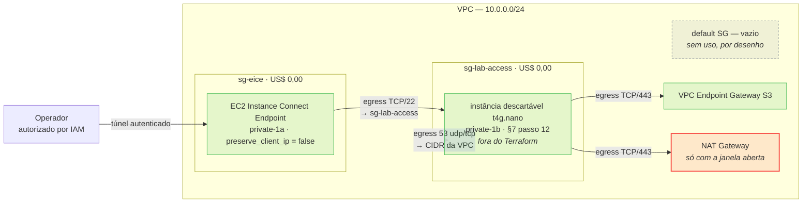

# ADR-0002 — Security groups do caminho de acesso e supressões autorizadas do checkov

| Campo            | Valor                                                                                              |
| ---------------- | -------------------------------------------------------------------------------------------------- |
| **Status**       | Aprovado                                                                                           |
| **Data**         | 2026-08-14                                                                                         |
| **Aprovado em**  | 2026-08-14                                                                                         |
| **Autor**        | Agente Arquiteto Cloud e DevOps                                                                    |
| **Decisor**      | Laura Segouras — decisão delegada ao orquestrador em 2026-08-14 ("faça o que for necessário")      |
| **Relacionados** | **Emenda o ADR-0001**, que permanece `Aprovado` e em vigor. Não o substitui nem o revoga.          |
| **Tags**         | aws, terraform, vpc, security-group, ec2-instance-connect, checkov, workshop                       |

**Escopo desta emenda.** Altera **apenas** os pontos listados em §5. Todo o resto do ADR-0001 — CIDRs, AZs, NAT efêmero, route tables, endpoints, flow logs, budget, state, layout — continua valendo sem modificação.

---

## 1. Contexto

O código do módulo `network` está completo e validado em `project-terraform/01-networking-stack/modules/network/`. **Nada foi aplicado na AWS.** A implementação das etapas 1 a 4 (`docs/implementation/ADR-0001-log.md`) expôs duas contradições internas do ADR-0001 que só se manifestam em runtime, não no `apply`.

| #   | Contradição                                                                                                                                                                                                                                       |
| --- | ------------------------------------------------------------------------------------------------------------------------------------------------------------------------------------------------------------------------------------------------- |
| 1   | §6 cria o EC2 Instance Connect Endpoint · §9 esvazia o default security group · §9 proíbe criar SG nesta camada. `aws_ec2_instance_connect_endpoint` sem `security_group_ids` herda o default SG — agora vazio. O `apply` passa; a conexão não. |
| 2   | §10 fixa retenção de 7 dias no log group de flow logs, e `CKV_AWS_338` exige 1 ano. §7 passo 10 autoriza suprimir **apenas** o que a tabela de trade-offs de §5 lista, e retenção curta não está lá. Mesmo caso de `CKV2_AWS_19` e `CKV_AWS_130`. |

O `devops-engineer` implementou o ADR como escrito nos dois casos e escalou, o que é o comportamento correto: nenhum dos dois é detalhe de implementação.

---

## 2. Requisitos e restrições

- **Funcionais:** o passo 12 de §7 do ADR-0001 — acesso à instância descartável via EIC Endpoint, sem IP público e sem bastion, seguido de `curl` na API do ECR e `docker pull` — precisa ser executável · o relatório do checkov precisa distinguir achado aceito de achado não avaliado.
- **Não funcionais:** custo adicional **US$ 0,00**, sem exceção · nenhuma alteração no estado default de custo zero do ADR-0001 · nenhum recurso novo com cobrança horária.
- **Restrições:** teto de US$ 5,00 do curso inteiro (C1 do ADR-0001) · SG de **workload** continua pertencendo ao ADR de compute · `.claude/rules/terraform-naming.md` vale integralmente.

---

## 3. Premissas

| #   | Premissa                                                                                                                                                                  | Bloqueante? | Como validar                                                                                        |
| --- | ------------------------------------------------------------------------------------------------------------------------------------------------------------------------- | ----------- | ----------------------------------------------------------------------------------------------------- |
| P1  | A instância descartável do passo 12 é lançada **fora do Terraform** e recebe o SG `lab-access` explicitamente no `--security-group-ids`.                                  | **Sim**     | Se for esquecida, a instância cai no default SG vazio e o teste falha de novo. Critério de aceite A5. |
| P2  | Regras de egress de security group **se aplicam** ao resolver DNS da VPC (base do CIDR + 2). Não confirmado na documentação; as regras de DNS entram por precaução.        | Não         | Se não se aplicarem, as duas regras de porta 53 são inócuas e não custam nada. Ver §16.              |
| P3  | O `docker pull` do ECR e o `curl` na API do ECR usam exclusivamente TCP/443.                                                                                              | Não         | Passo 12. Se algo exigir outra porta, é uma regra a acrescentar, não redesenho.                       |
| P4  | As premissas P1 a P9 do ADR-0001 seguem válidas e inalteradas — inclusive P8 e P9, ainda sem resposta do professor.                                                       | **Sim**     | Herdadas. Esta emenda não as resolve.                                                                |

---

## 4. Opções consideradas

### 4.1 Caminho de acesso ao EIC Endpoint

| Opção                                                                   | Prós                                                                                            | Contras                                                                                                                              | Custo    |
| ----------------------------------------------------------------------- | ----------------------------------------------------------------------------------------------- | -------------------------------------------------------------------------------------------------------------------------------------- | -------- |
| **A — Dois SGs dedicados** (endpoint + alvo), com referência SG↔SG      | Resolve os dois lados do caminho; ensina SG referencing, que é o padrão canônico da AWS         | 7 recursos novos; ocupa território que §9 reservava ao ADR de compute                                                                 | US$ 0,00 |
| **B — Um SG só do endpoint** (sugestão do engineer)                     | Delta mínimo, 3 recursos                                                                        | **Incompleto.** Destrava o endpoint, mas a instância-alvo continua no default SG vazio: sem ingress 22 e sem egress 443, o passo 12 falha igual | US$ 0,00 |
| **C — SG único auto-referenciado** para endpoint e instância            | 1 SG, 4 regras                                                                                  | Confunde proxy e alvo num só artefato; o ADR de compute herdaria a confusão                                                          | US$ 0,00 |
| **D — Abrir mão do EIC Endpoint**; validar egress por `user_data` + console output | Zero SG nesta camada                                                                  | Perde o exercício de acesso privado; console output é assíncrono e não interativo; troubleshooting do passo 12 fica cego             | US$ 0,00 |
| **E — Mover EIC Endpoint para o ADR de compute**                        | Mantém §9 intacto                                                                               | O passo 12 e o critério de aceite "acesso via EIC Endpoint" são **deste** ADR; empurrar o endpoint sem empurrar o critério não fecha  | US$ 0,00 |

> A Opção B é o diagnóstico correto do engineer aplicado a metade do problema. O default SG vazio quebra o caminho nos **dois** sentidos: o endpoint não sai, e a instância não deixa entrar nem sair.

### 4.2 Achados do checkov sem autorização de supressão

| Opção                                          | Prós                                                                          | Contras                                                                                                                                       |
| ---------------------------------------------- | ----------------------------------------------------------------------------- | ----------------------------------------------------------------------------------------------------------------------------------------------- |
| **A — Autorizar supressão nominal por ID + recurso** | Relatório verde significa "avaliado"; cada `skip` carrega justificativa rastreável ao ADR | Exige manutenção da lista a cada achado novo                                                                                          |
| **B — Manter os findings vermelhos**           | Nenhuma decisão a tomar                                                       | Vermelho permanente treina a ignorar o relatório; o próximo achado **real** entra no meio de 4 falsos e passa despercebido                    |

### 4.3 Mecanismo documental

| Opção                                    | Prós                                                                                                     | Contras                                                                                                                                                          |
| ---------------------------------------- | ---------------------------------------------------------------------------------------------------------- | ------------------------------------------------------------------------------------------------------------------------------------------------------------------ |
| **A — ADR-0002 emendando o ADR-0001**    | Preserva o carimbo de aprovação de 2026-08-12; o log de implementação continua citando §§ que não mudaram; revisão humana lê ~250 linhas, não 673 | Duas fontes a ler; o ADR-0001 não aponta para o sucessor até que um humano acrescente a linha    |
| **B — Reabrir o ADR-0001 para `Proposto`** | Documento único                                                                                          | Reescreve texto já aprovado sob o mesmo carimbo — aprovação forjada; invalida as referências de §§ nas 4 etapas do log; exige re-aprovação das 673 linhas         |
| **C — Errata inline no ADR-0001**        | Documento único, histórico no git                                                                        | Mesmo defeito de B, sem sequer mudar o status: quem lê o cabeçalho `Aprovado` não sabe que o corpo mudou depois                                                    |

---

## 5. Decisão

### 5.1 Mecanismo: emenda por ADR-0002 (Opção 4.3-A)

O ADR-0001 permanece **`Aprovado` e imutável**. Esta emenda altera exclusivamente os pontos das tabelas 5.2 e 5.3; tudo o mais lá continua em vigor e é lido no documento original.

**Rastro de auditoria:** o carimbo `Aprovado em 2026-08-12 por Laura` continua descrevendo exatamente o texto que Laura aprovou. As quatro entradas do log de implementação continuam citando §§ cujo conteúdo não mudou. O que mudou tem número próprio, data própria e vai exigir aprovação própria. Reabrir o 0001 trocaria tudo isso por um documento único cujo estado de aprovação passaria a ser ambíguo.

> **Ação para o humano, após aprovar este ADR:** acrescentar `emendado por ADR-0002` ao campo **Relacionados** do cabeçalho do ADR-0001. É atualização de metadado de referência cruzada, não reescrita de decisão — e sem ela um leitor que abra só o 0001 não descobre esta emenda. **Não a apliquei:** editar ADR aprovado não é minha prerrogativa.

### 5.2 Divergência 1 — dois security groups dedicados ao caminho de acesso (Opção 4.1-A)

**Princípio de fronteira que esta emenda fixa, e que resolve a ambiguidade de §9 do ADR-0001 daqui para frente:**

> A camada de rede é dona dos security groups **dos endpoints que ela cria** e **do caminho de validação que ela própria exige** em §7. O ADR de compute é dono dos security groups **de workload** — aplicação, load balancer, banco.

§9 do ADR-0001 dizia "nenhum SG de aplicação é criado aqui", e isso continua verdadeiro: nenhum dos dois SGs abaixo serve a uma aplicação. O default SG segue esvaziado, e agora legitimamente — nada mais depende dele.

| SG                              | Anexado a                                               | Regras                                                                                                                                  |
| ------------------------------- | ------------------------------------------------------- | --------------------------------------------------------------------------------------------------------------------------------------- |
| `dvn-workshop-prd-sg-eice`      | `aws_ec2_instance_connect_endpoint.this`                | **Egress** TCP/22 → SG `lab-access` (por referência). **Sem ingress** — o tráfego vem do serviço EIC e é permitido independente de ingress |
| `dvn-workshop-prd-sg-lab-access` | Instância descartável do §7 passo 12, no lançamento     | **Ingress** TCP/22 ← SG `eice`. **Egress** TCP/443 → `0.0.0.0/0`; UDP/53 e TCP/53 → CIDR da VPC                                          |

**Referência SG↔SG, não CIDR.** A documentação da AWS admite as duas formas, e a referência entre security groups é imune ao valor de `preserve_client_ip` — a página é explícita: a regra por SG funciona *"whether client IP preservation is on or off"*. Com CIDR, a origem correta muda conforme a flag, e errar produz exatamente a falha silenciosa que esta emenda existe para eliminar.

**`preserve_client_ip = false`, explícito.** A documentação do provider Terraform declara default `true`; a do CloudFormation e da API declara default `false`. As duas foram lidas via MCP e se contradizem. Deixar implícito faz o comportamento depender de qual documento o leitor abriu. Com referência SG↔SG o valor não altera a conectividade — é o registro da ambiguidade que importa.

**Egress do lado do alvo é escopado, não `-1`.** TCP/443 cobre a API do ECR e as camadas de imagem via Gateway Endpoint de S3. As duas regras de porta 53 entram por P2. `ip_protocol = "-1"` para `0.0.0.0/0` seria mais simples e dispararia um achado de egress aberto no checkov — trocar um achado por outro não é solução.

**Custo: US$ 0,00.** Security group e regra de security group não são recursos tarifados, em nenhuma quantidade. O estado default do laboratório continua custando US$ 0,00/h.

### 5.3 Divergência 2 — supressões autorizadas de checkov

Esta tabela **substitui** a autorização difusa do §7 passo 10 do ADR-0001 ("apenas o que está listado como trade-off aceito em §5") por uma lista nominal. Cada `skip` no código leva comentário apontando para **ADR-0002 §5.3**.

| ID              | Recurso                        | Justificativa                                                                                                                                                        |
| --------------- | ------------------------------ | ---------------------------------------------------------------------------------------------------------------------------------------------------------------------- |
| `CKV_AWS_338`   | `aws_cloudwatch_log_group.this` | O log group é **destruído ao fechar a janela de custo** (§13 do ADR-0001). Seu tempo de vida é de horas; 7 dias de retenção já excede a existência do recurso. Reter 1 ano descreveria um ciclo de dados que não ocorre |
| `CKV2_AWS_19`   | `aws_eip.nat[0]`               | O EIP está anexado a um NAT Gateway via `allocation_id`, não a uma instância EC2. O check não modela essa associação. R6 do ADR-0001 já cobre o risco de EIP órfão, por outro caminho |
| `CKV_AWS_130`   | `aws_subnet.public[*]`         | `map_public_ip_on_launch = true` é exigência de §6 e critério de aceite de §14 do ADR-0001; §9 registra que é **habilitação, não exposição**. As subnets privadas passam no mesmo check |
| `CKV_AWS_158`   | `aws_cloudwatch_log_group.this` | Já autorizado por §5 do ADR-0001 ("CMK do KMS no log group") e já suprimido na etapa 4. Repetido aqui só para a lista ser completa — **sem mudança**                  |
| `CKV2_AWS_5` ⚠️ | `aws_security_group.lab_access` | Esperado, não medido. O SG é anexado no lançamento da instância descartável, fora do Terraform por desenho — a instância é efêmera e não pertence ao state             |

**Limite da autorização, que continua valendo:** achado em recurso **não listado** nesta tabela **não pode ser suprimido** — escale ao Arquiteto, como foi feito aqui. Se o ID real de `CKV2_AWS_5` divergir, aplique a mesma justificativa ao ID que efetivamente disparar sobre `aws_security_group.lab_access` e reporte o ID correto; qualquer outro achado sobre os SGs novos é escalação.

`CKV_AWS_23` (descrição obrigatória em SG e regra) **não é suprimido**: toda regra leva `description`, e o check passa.

### 5.4 Well-Architected — o que muda

| Pilar                  | Efeito                                                                                                                                                                        |
| ---------------------- | ------------------------------------------------------------------------------------------------------------------------------------------------------------------------------- |
| Segurança              | **Melhora.** Sai um default SG vazio servindo por omissão a um endpoint; entram dois SGs de propósito único, com least privilege real — uma porta, uma direção, origem por referência |
| Excelência Operacional | **Melhora.** O relatório do checkov volta a ser sinal: verde = avaliado, vermelho = novo                                                                                       |
| Otimização de Custos   | **Neutro.** US$ 0,00 adicionais                                                                                                                                               |
| Confiabilidade, Performance, Sustentabilidade | **Sem efeito.**                                                                                                                                        |

**Trade-off aceito:** a camada de rede passa a conter SGs, o que aproxima a fronteira com o ADR de compute. Mitigado pelo princípio de fronteira de §5.2 e pelo escopo estreito das regras — nenhuma delas serve a workload.

---

## 6. Arquitetura proposta

Delta sobre §6 do ADR-0001. Nenhum componente removido; nenhum componente tarifado acrescentado.



**Limite de confiança revisado.** A linha "Operador → instância privada" de §6 do ADR-0001 passa a ter três controles em série, não um: IAM autoriza o uso do endpoint · o SG do endpoint restringe o destino a TCP/22 no SG do alvo · o SG do alvo só aceita ingress originado no SG do endpoint. CloudTrail continua registrando as tentativas.

---

## 7. Plano de implementação

Etapas do `devops-engineer`. Nenhuma toca a AWS: o bucket de state ainda não existe e o `apply` continua sendo a etapa 5 do ADR-0001.

| #   | Etapa                                                                                                                                          | Depende de | Validação                                                                     | Esforço |
| --- | ---------------------------------------------------------------------------------------------------------------------------------------------- | ---------- | ------------------------------------------------------------------------------- | ------- |
| 1   | Acrescentar os 2 SGs e as 5 regras a `modules/network/vpc.security-groups.tf`                                                                  | —          | `fmt -check`, `validate` e `tflint --recursive` limpos                        | 40 min  |
| 2   | Em `vpc.endpoints.tf`: `security_group_ids = [aws_security_group.eice.id]` e `preserve_client_ip = false`; substituir o comentário de divergência por referência a este ADR | 1          | `validate` limpo                                                              | 10 min  |
| 3   | Outputs `eice_security_group_id` e `lab_access_security_group_id` no módulo e na raiz                                                          | 1          | `validate` limpo                                                              | 10 min  |
| 4   | Aplicar os `checkov:skip` de §5.3, cada um com comentário apontando para **ADR-0002 §5.3**                                                     | 1–3        | `checkov` nas duas variantes com `Failed 0`; todo `skip` justificado          | 30 min  |
| 5   | Reportar os IDs de checkov **reais** após a mudança, incluindo qualquer achado novo sobre os SGs                                               | 4          | Relatório no PR; achado fora da lista de §5.3 volta ao Arquiteto              | 10 min  |

**Esforço total: ~1 h 40. Custo: US$ 0,00** — nenhum recurso tarifado é criado, e nada é aplicado.

---

## 8. Layout de diretórios

Inalterado em relação ao ADR-0001 §8, com a divergência de layout já determinada pela usuária: a raiz Terraform é `project-terraform/01-networking-stack/` e o módulo vive em `01-networking-stack/modules/network/`.

Os SGs novos e suas regras vão **em `vpc.security-groups.tf`**, junto do `aws_default_security_group` — a regra de `.claude/rules/terraform-naming.md` manda o recurso e tudo que existe só para ele ficarem no mesmo arquivo, e o nome do arquivo já está no plural. Nenhum arquivo novo.

| Recurso AWS                                         | Identificador Terraform                          |
| ---------------------------------------------------- | ------------------------------------------------ |
| `dvn-workshop-prd-sg-eice`                          | `aws_security_group.eice`                        |
| `dvn-workshop-prd-sg-lab-access`                    | `aws_security_group.lab_access`                  |
| egress TCP/22 do endpoint para o alvo               | `aws_vpc_security_group_egress_rule.eice_ssh`    |
| ingress TCP/22 no alvo vindo do endpoint            | `aws_vpc_security_group_ingress_rule.lab_ssh`    |
| egress TCP/443 do alvo                              | `aws_vpc_security_group_egress_rule.lab_https`   |
| egress UDP/53 do alvo                               | `aws_vpc_security_group_egress_rule.lab_dns_udp` |
| egress TCP/53 do alvo                               | `aws_vpc_security_group_egress_rule.lab_dns_tcp` |

Nomes de recurso na AWS seguem o padrão `<projeto>-<ambiente>-<tipo>[-<qualificador>]` de §8 do ADR-0001, com os sufixos `sg-eice` e `sg-lab-access` acrescentados à lista de `<tipo>`. As 6 tags obrigatórias chegam por `default_tags`; `Name` vai no recurso.

**Sem variável nova.** O CIDR da VPC sai de `aws_vpc.this.cidr_block`; portas são constantes de protocolo, não valores de ambiente — mesmo tratamento já dado a `enable_dns_support`.

**Regras como recursos separados, nunca blocos inline.** Duas razões, ambas duras: a documentação do provider proíbe misturar `aws_vpc_security_group_*_rule` com blocos `ingress`/`egress` no mesmo SG, sob pena de conflito e diff perpétuo; e como os dois SGs se referenciam mutuamente, blocos inline criariam **ciclo de dependência** entre os dois recursos. Com regras separadas, os SGs são criados primeiro e as regras depois — sem ciclo.

```hcl
# REFERÊNCIA — não é entregável. Ilustra a forma, não o conteúdo final.
resource "aws_vpc_security_group_egress_rule" "eice_ssh" {
  security_group_id = aws_security_group.eice.id

  description                  = "SSH para as instancias do laboratorio (ADR-0002 §5.2)"
  referenced_security_group_id = aws_security_group.lab_access.id
  from_port                    = 22
  to_port                      = 22
  ip_protocol                  = "tcp"

  tags = {
    Name = "dvn-workshop-prd-sgr-eice-ssh"
  }
}
```

---

## 9. Segurança e IAM

Substitui os dois primeiros parágrafos de §9 do ADR-0001; o restante daquela seção — NACLs, role de Flow Logs, criptografia, exposição de rede, credenciais — segue inalterado.

- **Default SG:** continua gerenciado por `aws_default_security_group` sem nenhuma regra. Agora nenhum recurso depende dele, que é a condição para essa decisão ser segura em vez de quebrada.
- **SGs criados:** exatamente os dois de §5.2. Nenhum SG de workload nesta camada.
- **Ingress total na VPC:** uma única regra, TCP/22, com origem `referenced_security_group_id` — nenhuma regra de ingress a partir de CIDR, em nenhum SG, em nenhuma porta.
- **Egress total:** TCP/22 entre os dois SGs, TCP/443 para a internet e porta 53 para dentro da VPC. Nenhuma regra `ip_protocol = "-1"`.
- **IAM:** inalterado. O uso do EIC Endpoint continua autorizado por IAM e registrado em CloudTrail; nenhuma role, policy ou permissão nova.

---

## 10. Observabilidade

Inalterada em relação a §10 do ADR-0001, inclusive a **retenção de 7 dias** do log group de flow logs — §5.3 documenta a justificativa correta dessa retenção e autoriza a supressão do check, sem alterar o valor.

---

## 11. Custos

**US$ 0,00.** Security groups e regras de security group não são tarifados. O estado default do laboratório continua em US$ 0,00/h e a unidade de custo de §11.3 do ADR-0001 — **US$ 0,050 por hora de janela aberta** — permanece o único número que governa o orçamento.

---

## 12. Riscos e mitigação

| ID  | Risco                                                                                                                     | Prob.  | Impacto | Mitigação                                                                                        |
| --- | ------------------------------------------------------------------------------------------------------------------------- | ------ | ------- | -------------------------------------------------------------------------------------------------- |
| R14 | **Instância do passo 12 lançada sem o SG `lab-access`**, caindo no default vazio. Reproduz a falha original.              | Média  | Médio   | Output `lab_access_security_group_id`; critério de aceite A5 exige o SG no comando de lançamento. |
| R15 | Egress escopado a 443 e 53 barra algo que o passo 12 precise (P3).                                                        | Baixa  | Baixo   | Falha na hora, com sintoma claro. Correção é uma regra a mais, dentro desta camada.               |
| R16 | Supressão autorizada esconde regressão futura — o dia em que `CKV_AWS_130` falhar por outro motivo.                       | Baixa  | Médio   | `skip` é sempre por recurso nomeado, nunca global; §5.3 fecha a lista.                            |
| R17 | Um humano aprova este ADR e esquece de acrescentar a referência cruzada no ADR-0001; quem lê só o 0001 não vê a emenda.   | **Alta** | Médio  | Ação nomeada em §5.2 e repetida em §15.                                                           |
| R18 | `preserve_client_ip` com defaults documentados contraditórios entre provider e API.                                      | Certa  | Baixo   | Valor escrito explicitamente; a referência SG↔SG é imune ao valor de qualquer forma.              |

Os riscos R0 a R13 do ADR-0001 seguem válidos e inalterados. R0 — `destroy` esquecido — continua sendo o risco dominante do projeto.

---

## 13. Rollback

**Reversível por completo, sem ponto de não retorno.** Nada foi aplicado na AWS. Reverter é `git revert` do commit desta emenda: o módulo volta ao estado atual, com o EIC Endpoint criado e inacessível.

Se já aplicado quando a reversão for desejada: remover os dois SGs exige antes desanexá-los — a instância descartável tem de ser destruída e `security_group_ids` retirado do endpoint, o que **recria** o endpoint (`Update requires: Replacement`). Custo da operação: US$ 0,00. O procedimento de fechar a janela de custo de §13 do ADR-0001 não muda em nada.

---

## 14. Critérios de aceite

**Código**

- [ ] A1 — 2 `aws_security_group` e 5 regras em `vpc.security-groups.tf`; **nenhum** bloco `ingress`/`egress` inline nos SGs novos.
- [ ] A2 — `aws_ec2_instance_connect_endpoint.this` com `security_group_ids = [aws_security_group.eice.id]` e `preserve_client_ip = false`.
- [ ] A3 — Toda regra com `description`; nenhuma com `ip_protocol = "-1"`; nenhuma regra de ingress com origem em CIDR.
- [ ] A4 — `fmt -check`, `validate` (raiz e módulo) e `tflint --recursive` limpos, com o ruleset `aws` carregado **nos dois diretórios** (conferir `tflint --version` em cada um antes de confiar no resultado).
- [ ] A5 — `checkov` com `--var-file terraform.tfvars` **e** com a variante de janela aberta: `Failed 0` nas duas; todo `Skipped` justificado apontando para ADR-0002 §5.3.
- [ ] A6 — Outputs `eice_security_group_id` e `lab_access_security_group_id` expostos pelo módulo e pela raiz.
- [ ] A7 — Nenhum CIDR, AZ, região, conta ou ARN literal introduzido em `modules/network`.

**Custo — herdados do ADR-0001 §14 e reafirmados**

- [ ] A8 — `plan` sem variáveis extras continua criando **zero** recursos tarifados. Os 7 recursos novos entram no estado base a US$ 0,00.
- [ ] A9 — `plan -var="enable_nat_gateway=true"` continua criando **exatamente 4** recursos.

**Funcional — na etapa 5 do ADR-0001, dentro da janela de custo**

- [ ] A10 — A instância descartável em `10.0.0.192/26` é lançada com o SG `lab-access` explícito e **sem IP público**.
- [ ] A11 — A conexão a ela ocorre via EIC Endpoint, sem bastion, e a sessão executa `curl` na API do ECR e `docker pull` com sucesso.

---

## 15. Handoff para o DevOps Engineer

**Pré-requisitos**

| #   | Item                                                                                                                      |
| --- | ------------------------------------------------------------------------------------------------------------------------- |
| 1   | **Este ADR com status `Aprovado`.** Enquanto estiver `Proposto`, não implemente — é o mesmo portão do ADR-0001.           |
| 2   | ADR-0001 continua `Aprovado`; leia os dois. Onde houver conflito, **este ADR vence**, e só nos pontos de §5.2 e §5.3.     |
| 3   | Nenhum acesso novo. Nada aqui toca a AWS.                                                                                 |
| 4   | Os pendentes do ADR-0001 seguem abertos e continuam bloqueando o `apply`: bucket de state, sessão do profile, datas do curso, P8/P9, Cost Allocation Tag, assinatura de e-mail. Esta emenda **não** desbloqueia nenhum deles. |

**Ordem de execução:** §7, etapas 1 → 5, na ordem. Depois disso o módulo `network` fica completo e a etapa 5 do ADR-0001 (o `apply`) segue bloqueada pelos itens do pré-requisito 4.

**Pontos de atenção**

1. **Não use blocos `ingress`/`egress` inline** nos SGs novos — ciclo de dependência entre os dois SGs, além do conflito que o provider adverte.
2. **Referência SG↔SG, nunca CIDR, nas regras de porta 22.** É o que torna a conexão imune ao valor de `preserve_client_ip`.
3. **O default SG continua vazio.** Nada muda em `aws_default_security_group.this`, e a advertência sobre `aws_default_network_acl` (R5 do ADR-0001) continua valendo em dobro.
4. **Substitua o comentário de divergência** no topo de `aws_ec2_instance_connect_endpoint` em `vpc.endpoints.tf` — ele descreve uma lacuna que este ADR fecha, e deixá-lo lá desinforma o próximo leitor.
5. **Comentário `.tf` em ASCII.** O checkov 3.3.10 aborta com `UnicodeDecodeError` diante de emoji neste ambiente, conforme medido na etapa 4. `§` e acentuação passam.

**O que reportar:** diff dos 3 arquivos · saída de `tflint --version` nos dois diretórios · `checkov` nas duas variantes com a lista de `Skipped` e as justificativas · **os IDs reais de checkov**, em especial o que dispara sobre `aws_security_group.lab_access` · qualquer achado sobre os SGs novos fora da lista de §5.3 — esse volta para o Arquiteto, não vira `skip`.

**Segue deliberadamente em aberto:** SGs de workload, load balancer, DNS e TLS (ADR de compute) · plataforma de compute (R3 e R11 do ADR-0001) · política do Gateway Endpoint de S3 · `.checkov.yaml` fixando `--var-file` e `--skip-path`, sugerido quatro vezes no log de implementação e ainda não decidido — é melhoria de tooling, não de arquitetura, e não precisa de ADR.

---

## 16. Referências

### AWS Documentation via MCP `aws-mcp` (2026-08-14)

- **Security groups for EC2 Instance Connect Endpoint** — o SG do endpoint precisa de regra de **saída** TCP/22 para os alvos (por SG ou por CIDR da VPC); o tráfego que chega ao endpoint é permitido **independente das regras de ingress**; o SG do alvo precisa de **entrada** TCP/22, e a forma por referência de SG funciona *"whether client IP preservation is on or off"*: https://docs.aws.amazon.com/AWSEC2/latest/UserGuide/eice-security-groups.html
- **Connect to your instances using a private IP address and EC2 Instance Connect Endpoint** — o endpoint é um proxy TCP identity-aware; autorização por IAM antes do tráfego entrar na VPC: https://docs.aws.amazon.com/AWSEC2/latest/UserGuide/connect-with-ec2-instance-connect-endpoint.html
- **AWS::EC2::InstanceConnectEndpoint** — `PreserveClientIp` documentado com **default `false`**; `SecurityGroupIds` opcional, "if you don't specify a security group, the default security group for your VPC will be associated"; máximo 16 SGs: https://docs.aws.amazon.com/AWSCloudFormation/latest/TemplateReference/aws-resource-ec2-instanceconnectendpoint.html
- **Modify an EC2 Instance Connect Endpoint** — modificar SGs exige ao menos um SG; preservação de client IP só em endpoint IPv4: https://docs.aws.amazon.com/AWSEC2/latest/UserGuide/modify-ec2-instance-connect-endpoint.html

### Terraform Registry via MCP `terraform` — provider `hashicorp/aws` **6.59.0**, a versão do `.terraform.lock.hcl`

| Recurso                                | `provider_doc_id` | O que foi confirmado                                                                                                                     |
| -------------------------------------- | ----------------- | ------------------------------------------------------------------------------------------------------------------------------------------ |
| `aws_ec2_instance_connect_endpoint`    | `13196330`        | `security_group_ids` (Optional, herda o default SG da VPC se omitido), `subnet_id` (Required), `preserve_client_ip` — **doc do provider declara default `true`** |
| `aws_security_group`                   | `13197168`        | `name`, `description` (forces new, não pode ser `""`), `vpc_id`, `tags`; advertência formal contra misturar blocos inline com recursos de regra |
| `aws_vpc_security_group_egress_rule`   | `13197396`        | `security_group_id` (Required), `ip_protocol` (Required), `from_port`/`to_port`, `cidr_ipv4`, `referenced_security_group_id`, `description`, `tags` |
| `aws_vpc_security_group_ingress_rule`  | `13197397`        | Mesma forma, sentido de entrada                                                                                                          |

Pré-flight desta sessão: `terraform` no ar (`get_latest_provider_version(hashicorp/aws)` → `6.60.0`) e `aws-mcp` no ar (`sts:GetCallerIdentity` → conta esperada). Nenhuma fonte substituta foi usada.

### Pontos ⚠️ NÃO VERIFICADO

| Ponto                                                                                                                                     | Encaminhamento                                                                                                                    |
| ------------------------------------------------------------------------------------------------------------------------------------------- | ----------------------------------------------------------------------------------------------------------------------------------- |
| Se regras de egress de SG se aplicam ao resolver DNS da VPC (base do CIDR + 2). Três buscas na documentação não trouxeram afirmação direta. | P2. As regras de porta 53 entram por precaução: se não se aplicarem, são inócuas e custam US$ 0,00. Não há cenário em que atrapalhem. |
| `CKV2_AWS_5` como o ID que dispara sobre `aws_security_group.lab_access`. **Predição, não medição** — checkov não é domínio de MCP.        | §5.3 autoriza a justificativa vinculada ao recurso. O engineer reporta o ID real na etapa 5.                                        |
| `CKV_AWS_23` passar com `description` em toda regra. Mesma natureza: predição.                                                             | Se falhar, é achado sobre recurso novo → volta ao Arquiteto, conforme o limite de §5.3.                                             |
| Default real de `preserve_client_ip` — provider diz `true`, API/CloudFormation dizem `false`. Ambos lidos via MCP; contradizem-se.         | Neutralizado: o valor vai explícito e a referência SG↔SG é imune a ele.                                                            |
| Volume de tráfego e de flow logs; duração do curso; P8 e P9.                                                                              | Herdados do ADR-0001 §16, sem mudança.                                                                                             |
